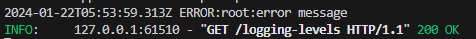
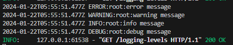
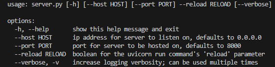

# Before starting
We'll be making a server using FastAPI to showcase the usage of Python's [argparse library](https://docs.python.org/3/library/argparse.html). First we must gather all required dependencies in case we do not already have it on our computer. Pip is a package manager for Python packages.  
- Install FastAPI by running `pip install fastapi`
- Install uvicorn by running `pip install uvicorn`  

If you do not have pip, install or upgrade your version of Python to the latest version.

# Setting up initial FastAPI server
At the top of our `server.py` file, we need to define the imports. FastAPI is used for creating API endpoints, and Uvicorn allows FastAPI to handle the browser requests. Logging will be for creating descriptive messages that will be displayed in our logs, and time will be for formatting how the logs are written. At the bottom will be the run command with hard-coded host and port, as well as reload being True. 

```py
from fastapi import FastAPI
import uvicorn
import random
import logging
import time

app = FastAPI()

if __name__ == "__main__":
    uvicorn.run("server:app", host="0.0.0.0", port=8000, reload=True)
```

Before creating any endpoints, let's add some argparse functionality in. 

# Setting up Argparse
Argparse is a Python library for adding command line arguments as flags to a Python file. We will create custom flags for the Uvicorn run command, logging verbosity, and optionally disabling a certain functionality.  

We'll start off by creating a new file, `args.py`, which will hold a function to parse the terminal for the flags we will define and store the values accordingly.

```py
import argparse

def get_args():
    parser = argparse.ArgumentParser()

    return parser.parse_args()
```

All our command line arguments will be defined inside this function. They must have a name for the flag along with help text to let the user know what the flag is for. There are other optional parameters that we will explore in a bit.  

Let's first define a flag for the host that the Uvicorn run command will use. This flag can be optional since most of the time people will be using `localhost`, so we should add that as the default value.  

We can also add another flag for the port, which will also be optional. The default port will be 8000, and this time we will also specify the data type as an integer.

```py
import argparse

def get_args():
    parser = argparse.ArgumentParser()
    parser.add_argument(
        "--host",
        default="localhost",
        help="host for server to listen on, defaults to localhost"
    )
    parser.add_argument(
        "--port",
        type=int,
        default=8000,
        help="port for server to be hosted on, defaults to 8000"
    )
    return parser.parse_args()
```

Since the Uvicorn run command also contains a boolean for whether the "reload" mode is enabled or not, let's make a flag of boolean type to either turn it on or off. However, this flag will be required since the user must specify if they want "reload" mode or not.

```py
    parser.add_argument(
        "--reload",
        type=bool,
        required=True,
        help="boolean for the uvicorn run command's 'reload' parameter"
    )
```

# Testing it in our server

Now that we have defined all 3 flags for our Uvicorn run command parameters, let's put them to use. Import the `get_args` method from the file we just created as `from args import get_args` next to our other imports. We can also create a variable to call the `get_args()` method so we can reference what we specify in the terminal at runtime.  

With the `args` variable, we are now able to reference all the flags we created. The values we previously set for the Uvicorn run command will be replaced with the arguments such as `args.host`, `args.port`, and `args.reload`.

```py
from fastapi import FastAPI
import uvicorn
import logging
import time

from args import get_args

app = FastAPI()
args = get_args()

if __name__ == "__main__":
    uvicorn.run("server:app", host=args.host, port=args.port, reload=args.reload)
```

When you try to run the server using `python server.py`, you will notice that it will give an error. This is because we required the `--reload` variable to be specified. Run the server with `python server.py --reload=True` to enable reload mode, or `--reload=False` if you do not want live reloading. Host and port are not required, however if you want to specify them, you can chain flags such as `python server.py --port=5000 --reload=True`.

# Logging Verbosity with Argparse

### args.py
So far the arguments have been straightforward, but we can implement a different type of flag in order to dynamically change the verbosity of logs based on a 'v' count in our flag. For example, `python server.py --reload=True -vvv` will run with the highest level of logging. Python logging has a numeric value attached to each log level, where the lower the number gets, the more detailed/verbose the logs get. For this tutorial, we will work from logging.ERROR (40) to logging.DEBUG (10). By default, error logs will always show since they are important to take note of, but as we increase the amount of `v` in our flag, logging.WARNING (30), logging.INFO (20), and logging.DEBUG (10) will be logged.  

This flag will count how many instances of the flag are present, which we will use as a multiplier in the FastAPI server later. 

```py
    parser.add_argument(
            "--verbose",
            "-v",
            action="count",
            default=0,
            help="increase logging verbosity; can be used multiple times in a chain such as '-vvv'",
        )
```

By adding 2 names to the argument, we can either call this flag using `--verbose`, or a shorter version of just `-v`. 

### server.py
In order to test what kind of logs appear based on our usage of the flag, we will make a simple endpoint with a log of each type. The idea is that as we increase the counts of `-v` in the command line, more of these logs will appear in the terminal when we go to the `/logging-levels` endpoint.

```py
@app.get("/logging-levels")
def logging_levels():
    logging.error("error message")
    logging.warning("warning message")
    logging.info("info message")
    logging.debug("debug message")
```

We will also add custom formatting for the logs so we have control over the timezone and style in which the logs will appear. The last line is the most important since it incorporates the usage of our verbosity flag count in a creative way. When the argument is not specified in the command line, the count will be 0 and the logging level will remain at logging.ERROR's value of 40. This means that only ERROR logs will appear in the terminal. As the flag count increases, the multiplier will subtract from the level and decrease the logging level, unlocking more logging levels. When the flag is at the max count, which is 3 or more, the logging level will be 10 or below which means we will see logging.DEBUG statements.

```py
logging.Formatter.converter = time.gmtime
logging.basicConfig(
    format="%(asctime)s.%(msecs)03dZ %(levelname)s:%(name)s:%(message)s",
    datefmt="%Y-%m-%dT%H:%M:%S",
    level= logging.ERROR - (args.verbose*10),
)
```

Now our file will look like:
```py
from fastapi import FastAPI
import uvicorn
import logging
import time

from args import get_args

app = FastAPI()
args = get_args()

@app.get("/logging-levels")
def logging_levels():
    logging.error("error message")
    logging.warning("warning message")
    logging.info("info message")
    logging.debug("debug message")


logging.Formatter.converter = time.gmtime
logging.basicConfig(
    format="%(asctime)s.%(msecs)03dZ %(levelname)s:%(name)s:%(message)s",
    datefmt="%Y-%m-%dT%H:%M:%S",
    level= logging.ERROR - (args.verbose*10),
)

if __name__ == "__main__":
    uvicorn.run("server:app", host=args.host, port=args.port, reload=args.reload)
```

Try running the server with varying amounts of `-v` flags. Go to `localhost:8000/logging-levels` and check the terminal. With no verbosity flag specified, there will only be an ERROR log.  


When you run it with max verbosity using `python server.py --reload True -vvv` and go to the `/logging-levels` endpoint, you will see all the logs in the terminal.  


# Overview

With Argparse, you are able to set custom command line flags. You can make them required or not, have specified data types, or even treat the flag itself as a count of how many times it was used. To see it all come together in the command line, you can run `python server.py -h` and it will show all the help messages you have defined.  

